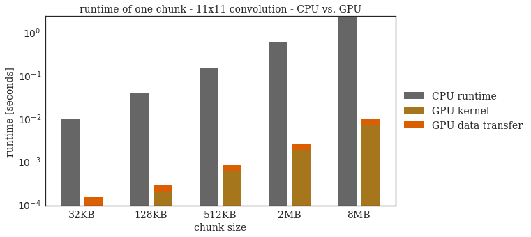
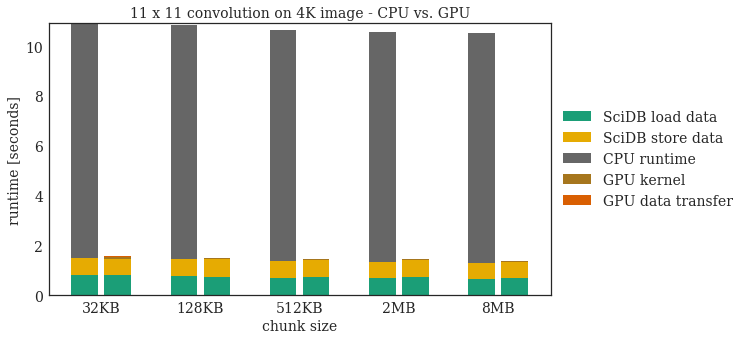
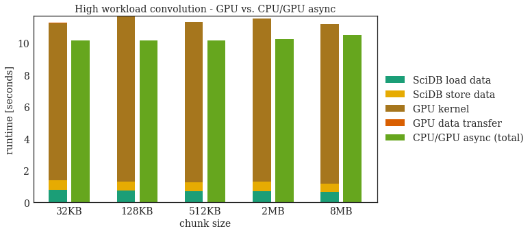
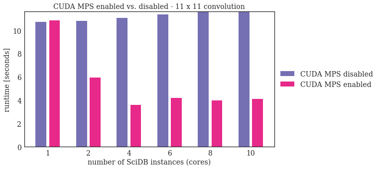
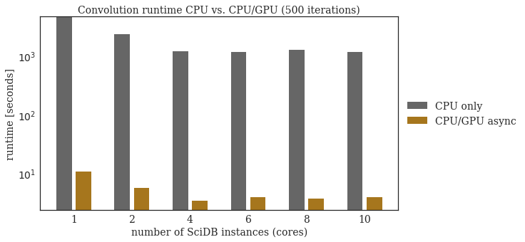
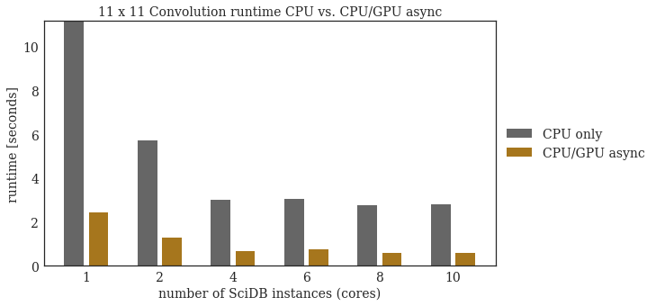

## Analyze the parameter space of SciDB and Cuda


```python
import csv
import os
import numpy as np
import time
from collections import defaultdict
import subprocess
import re
import datetime
import matplotlib.pyplot as plt
%matplotlib inline
```

Import helper classes and functions to run benchmarks and plot the results.


```python
from plotClusterStackBar import plotClusterStackBar
```

SciDBAnalyzer class is used to run the convolution benchmark and to do all cleanup und preparation of the individual runs. Furthermore it analyzes the log files of SciDB to extract the timeing information.


```python
class SciDBAnalyzer:
    """ Helper class to organize all tests and measurements."""
    
    def __init__(self,chunks):
        self.chunk_sizes = chunks
        self.iterations = 2
        self.query_ok=b'Query was executed successfully\n'
        self.config_nbrNodes = 0
        self.config_ChunkSize = 0
        self.statisitcs = defaultdict(lambda :defaultdict(list))
        self.detailStatisitcs = defaultdict(lambda :defaultdict(list))

        self.modes = dict()
        self.modes["CPU"]="runOn=CPU"
        self.modes["CPU_500"]="runOn=CPU,repetitions=500"
        self.modes["GPU"]="runOn=GPU"
        self.modes["GPU threads"]="runOn=GPU,GPUStreams=true"
        self.modes["GPU async"]="runOn=GPU,async=true"
        self.modes["CPU_500"]="runOn=CPU,repetitions=500"
        self.modes["GPU_500"]="runOn=GPU,repetitions=500"
        self.modes["GPU_500 async"]="runOn=GPU,async=true,repetitions=500"
        
    
    def getConfigStr(self):
        return ""+str(self.config_nbrNodes)+"_"+str(self.config_ChunkSize)
    
    def getArrayname(self,array):
        return str(array)+ "_" + str(self.config_ChunkSize)
    
    def setConfig(self, nbrNodex):
        self.config_nbrNodes = nbrNodex
    
    
    # run convolution in different modes for different chunk sizes
    def analyzeQueryConvolution(self, array, kernel, mode):
        
        for c_size in self.chunk_sizes:
            self.config_ChunkSize = c_size
            
            command="iquery -antq \"convolution("+self.getArrayname(array)+","+ \
                str(kernel)+",'"+self.modes[mode]+"');\""
                
            for x in range(0, self.iterations-1):
                #clear log
                subprocess.Popen("> /home/simon/scidbtrunk/stage/DB-mydb/0/0/scidb.log", \
                    shell=True,stdout=subprocess.PIPE).communicate()
                
                #run convolution query via bash
                start = time.time()
                #iquery_out = !iquery -antq "testop({array_name(array)},{kernel},'{self.modes[mode]}');"
                p = subprocess.Popen(command,shell=True,stdout=subprocess.PIPE)
                output, err = p.communicate()
                end = time.time()
                
                #if the query run successful
                if output==self.query_ok:
                    ((self.statisitcs[self.getConfigStr()])[mode]).append(end-start)
                    self.analyzeLog(mode)
                    print(output)
                    
                else:
                    ((self.statisitcs[self.getConfigStr()])[mode]).append(-1)
                    print(command,": ",output, err)
                    
    
    # analyze the log files to get timeing information         
    def analyzeLog(self, mode):
        #analyze the SciDB log to get exact timing information
        #(.{10})\s(.{8}),(\d{3})(.*):\s(.*)
        
        with open("/home/simon/scidbtrunk/stage/DB-mydb/0/0/scidb.log") as f:
            content = f.readlines()
        content = [x.strip() for x in content] 
        
        loadChunk=list()
        writeChunk=list()
        run=list()
        HtoD=list()
        DtoH=list()
        regex = re.compile(r'(.{23})(.*):\s(.*)', re.I)
        
        for line in content:
            res=regex.search(line)
            if res is None: continue
            groups=res.groups()
            
            if groups[2]=="getNextChunk": tmpLoadC = datetime.datetime.strptime(groups[0], "%Y-%m-%d %H:%M:%S,%f")
            if groups[2]=="getNextChunk done":
                tmpLoadC = datetime.datetime.strptime(groups[0], "%Y-%m-%d %H:%M:%S,%f")-tmpLoadC
                loadChunk.append( tmpLoadC.total_seconds() )
            if groups[2]=="writeChunk": tmpStoreC = datetime.datetime.strptime(groups[0], "%Y-%m-%d %H:%M:%S,%f")
            if groups[2]=="writeChunk done":
                tmpStoreC= datetime.datetime.strptime(groups[0], "%Y-%m-%d %H:%M:%S,%f")-tmpStoreC
                writeChunk.append( tmpStoreC.total_seconds() )
            if groups[2]=="copyChunkValues": tmpHtoD = datetime.datetime.strptime(groups[0], "%Y-%m-%d %H:%M:%S,%f")
            if groups[2]=="copyChunkValues done":
                tmpHtoD=datetime.datetime.strptime(groups[0], "%Y-%m-%d %H:%M:%S,%f")-tmpHtoD
                HtoD.append( tmpHtoD.total_seconds() )
            if groups[2]=="runConvolution": tmpRun = datetime.datetime.strptime(groups[0], "%Y-%m-%d %H:%M:%S,%f")
            if groups[2]=="runConvolution done":
                tmpRun=datetime.datetime.strptime(groups[0], "%Y-%m-%d %H:%M:%S,%f")-tmpRun
                run.append( tmpRun.total_seconds() )
            if groups[2]=="copyResultValues": tmpDtoH = datetime.datetime.strptime(groups[0], "%Y-%m-%d %H:%M:%S,%f")
            if groups[2]=="copyResultValues done":
                tmpDtoH = datetime.datetime.strptime(groups[0], "%Y-%m-%d %H:%M:%S,%f")-tmpDtoH
                DtoH.append( tmpDtoH.total_seconds() )
        
        tmpLoadC = sum(loadChunk)/len(loadChunk) if len(loadChunk)>0 else 0
        tmpStoreC = sum(writeChunk)/len(writeChunk) if len(writeChunk)>0 else 0
        tmpHtoD = sum(HtoD)/len(HtoD) if len(HtoD)>0 else 0
        tmpRun = sum(run)/len(run) if len(run)>0 else 0
        tmpDtoH = sum(DtoH)/len(DtoH) if len(DtoH)>0 else 0
        
        res=(tmpLoadC,sum(loadChunk),tmpStoreC,sum(writeChunk),tmpHtoD,sum(HtoD),tmpRun,sum(run),tmpDtoH,sum(DtoH))
        ((self.detailStatisitcs[self.getConfigStr()])[mode]).append( res )


    # create arrays in order to run tests. Use IPythons ! magic
    def createSciDBArrays(self, chunk_sizes):
        #create empty arrays
        !iquery -antq "create array kernel_import <x:int64,y:int64,kernel:float>[csv=0:*,50000,0];"
        !iquery -antq "create array aia_import <x:int64,y:int64,a0:int32,a1:int32,a2:int32,a3:int32,a4:int32,a5:int32>[csv=0:*,50000,0];"
        !iquery -antq "create array aia_import2 <x:int64,y:int64,a0:int16,a1:int16,a2:int16,a3:int16,a4:int16,a5:int16>[csv=0:*,50000,0];"
        !iquery -antq "load(aia_import2,'/home/simon/jupyter/res/import.opaque',-2,'opaque');"

        #create unique arrays
        !iquery -antq "load(kernel_import,'/home/simon/jupyter/res/gauss_11x11.csv',-2,'csv');"
        !iquery -antq "create array gauss_blur_11x11 <kernel:float>[y=0:10,11,0; x=0:10,11,0];"                                                                                  
        !iquery -antq "insert(redimension(kernel_import,gauss_blur_11x11),gauss_blur_11x11);"

        !iquery -antq "load(kernel_import,'/home/simon/jupyter/res/gauss_5x5.csv',-2,'csv');"
        !iquery -antq "create array gauss_blur_5x5 <kernel:float>[y=0:4,5,0; x=0:4,5,0];"                                                                                  
        !iquery -antq "insert(redimension(kernel_import,gauss_blur_5x5),gauss_blur_5x5);"

        !iquery -antq "load(kernel_import,'/home/simon/jupyter/res/gauss_3x3.csv',-2,'csv');"
        !iquery -antq "create array gauss_blur_3x3 <kernel:float>[y=0:2,3,0; x=0:2,3,0];"                                                                                  
        !iquery -antq "insert(redimension(kernel_import,gauss_blur_3x3),gauss_blur_3x3);"

        !iquery -antq "load(kernel_import,'/home/simon/jupyter/res/edge_3x3.csv',-2,'csv');"
        !iquery -antq "create array edge_3x3 <kernel:float>[y=0:2,3,0; x=0:2,3,0];"                                                                                  
        !iquery -antq "insert(redimension(kernel_import,edge_3x3),edge_3x3);"

        #create different chunk sizes
        for c_size in chunk_sizes:
            !iquery -antq "store(build(<val:int32>[y=0:4095,{c_size},5; x=0:4095,{c_size},5],y*4096+x),test_4096_{c_size});"
            !iquery -antq "create array aia_{c_size} <a0:int16,a1:int16,a2:int16,a3:int16,a4:int16,a5:int16>[x=0:4095,{c_size},5,y=0:4095,{c_size},5];"
            !iquery -antq "insert(redimension(aia_import2,aia_{c_size}),aia_{c_size});"

    
    # init SciDB cluster with a new number of instances. This removes all data!
    def initSciDB(self, nbrNodes,chunk_sizes):
        #stop SciDB
        scidb_stop = !scidb.py stopall mydb

        #copy config with nbrNodes
        scidb_copy = !cp /home/simon/scidbtrunk/stage/install/etc/config.ini_{nbrNodes} /home/simon/scidbtrunk/stage/install/etc/config.ini

        #init SciDB with new config (all data will be deleted)
        scidb_init = !scidb.py initall-force mydb

        #start SciDB 
        scidb_start = !scidb.py startall mydb

        #load libraries
        scidb_lib = !iquery -aq "load_library('testop');"
        scidb_lib = !iquery -aq "load_library('convolution');"

        #create SciDB Arrays
        self.createSciDBArrays(chunk_sizes)

```

#### Runtime of a single chunk CPU vs GPU
We use only 1 CPU core (equals 1 SciDB instance) and run the test with a NVIDIA GTX1070.


```python
# we use only 1 SciDB instance at the moment
chunk_sizes=[128,256,512,1024,2048]
config_cores = [1]

analyzer_chunks = SciDBAnalyzer(chunk_sizes)

#run convolution tests
for cores in config_cores:
    # init SciDB cluster
    analyzer_chunks.initSciDB(cores,chunk_sizes)
    analyzer_chunks.setConfig(cores)
    
    analyzer_chunks.analyzeQueryConvolution("test_4096", "gauss_blur_11x11", "CPU")
    analyzer_chunks.analyzeQueryConvolution("test_4096", "gauss_blur_11x11", "GPU")
    analyzer_chunks.analyzeQueryConvolution("test_4096", "gauss_blur_11x11", "GPU async")
```

    Query was executed successfully
    Query was executed successfully
    Query was executed successfully
    Query was executed successfully
    Query was executed successfully
    Query was executed successfully
    Query was executed successfully
    Query was executed successfully
    Query was executed successfully
    Query was executed successfully
    Query was executed successfully
    Query was executed successfully
    Query was executed successfully
    Query was executed successfully
    Query was executed successfully
    Query was executed successfully
    Query was executed successfully
    Query was executed successfully
    Query was executed successfully
    Query was executed successfully
    Query was executed successfully
    Query was executed successfully
    Query was executed successfully
    Query was executed successfully
    Query was executed successfully
    Query was executed successfully
    Query was executed successfully
    Query was executed successfully
    Query was executed successfully
    Query was executed successfully
    Query was executed successfully
    b'Query was executed successfully\n'
    b'Query was executed successfully\n'
    b'Query was executed successfully\n'
    b'Query was executed successfully\n'
    b'Query was executed successfully\n'
    b'Query was executed successfully\n'
    b'Query was executed successfully\n'
    b'Query was executed successfully\n'
    b'Query was executed successfully\n'
    b'Query was executed successfully\n'
    b'Query was executed successfully\n'
    b'Query was executed successfully\n'
    b'Query was executed successfully\n'
    b'Query was executed successfully\n'
    b'Query was executed successfully\n'


```python
bar_cpu=np.zeros(len(chunk_sizes))
bar_gpu=np.zeros(len(chunk_sizes))
bar_gpuOverhead=np.zeros(len(chunk_sizes))

for i in range(0,len(chunk_sizes)):
    conf = str(1)+"_"+str(chunk_sizes[i])
    tmp_cpu=0
    tmp_gpu=0
    tmp_gpuOver=0
    
    for iters in range(0,analyzer_chunks.iterations-1):
        tmp_cpu+=analyzer_chunks.detailStatisitcs[conf]["CPU"][iters][6]
        tmp_gpu+=analyzer_chunks.detailStatisitcs[conf]["GPU"][iters][6]
        tmp_gpuOver+=analyzer_chunks.detailStatisitcs[conf]["GPU"][iters][4]
        tmp_gpuOver+=analyzer_chunks.detailStatisitcs[conf]["GPU"][iters][8]
        
    bar_cpu[i]=tmp_cpu/(analyzer_chunks.iterations-1)
    bar_gpu[i]=tmp_gpu/(analyzer_chunks.iterations-1)
    bar_gpuOverhead[i]=tmp_gpuOver/(analyzer_chunks.iterations-1)
    
chunkPlot = plotClusterStackBar(2,5,3)
chunkPlot.setTitel("runtime of one chunk - 11x11 convolution - CPU vs. GPU")
chunkPlot.setXticks(['32KB','128KB','512KB','2MB','8MB'])
chunkPlot.setlegend(('CPU runtime','GPU kernel','GPU data transfer'))
chunkPlot.setXYLabels("chunk size","runtime [seconds]")
chunkPlot.setBarContent(0,0,bar_cpu)
chunkPlot.setBarContent(1,1,bar_gpu)
chunkPlot.setBarContent(1,2,bar_gpuOverhead)
# use same color for same things in all plots
chunkPlot.setColorToLayer(0,7)
chunkPlot.setColorToLayer(1,6)
chunkPlot.setColorToLayer(2,1)
chunkPlot.plot(log=True)
```





#### Runtime of a complete convolution CPU vs GPU
We use only 1 CPU core (equals 1 SciDB instance) and run the test with a NVIDIA GTX1070.


```python
bar_cpu=np.zeros(len(chunk_sizes))
bar_cpu_load=np.zeros(len(chunk_sizes))
bar_cpu_write=np.zeros(len(chunk_sizes))
bar_gpu=np.zeros(len(chunk_sizes))
bar_gpu_write=np.zeros(len(chunk_sizes))
bar_gpu_load=np.zeros(len(chunk_sizes))
bar_gpuOverhead=np.zeros(len(chunk_sizes))

for i in range(0,len(chunk_sizes)):
    conf = str(1)+"_"+str(chunk_sizes[i])
    tmp_cpu=0
    tmp_cpu_load=0
    tmp_cpu_write=0
    tmp_gpu=0
    tmp_gpu_load=0
    tmp_gpu_write=0
    tmp_gpuOver=0
    
    for iters in range(0,analyzer_chunks.iterations-1):
        tmp_cpu+=analyzer_chunks.detailStatisitcs[conf]["CPU"][iters][7]
        tmp_cpu_load+=analyzer_chunks.detailStatisitcs[conf]["CPU"][iters][1]
        tmp_cpu_write+=analyzer_chunks.detailStatisitcs[conf]["CPU"][iters][3]
        
        tmp_gpu_load+=analyzer_chunks.detailStatisitcs[conf]["GPU"][iters][1]
        tmp_gpu_write+=analyzer_chunks.detailStatisitcs[conf]["GPU"][iters][3]
        tmp_gpu+=analyzer_chunks.detailStatisitcs[conf]["GPU"][iters][7]
        tmp_gpuOver+=analyzer_chunks.detailStatisitcs[conf]["GPU"][iters][5]
        tmp_gpuOver+=analyzer_chunks.detailStatisitcs[conf]["GPU"][iters][9]
        
    bar_cpu[i]=tmp_cpu/(analyzer_chunks.iterations-1)
    bar_cpu_load[i]=tmp_cpu_load/(analyzer_chunks.iterations-1)
    bar_cpu_write[i]=tmp_cpu_write/(analyzer_chunks.iterations-1)
    
    bar_gpu[i]=tmp_gpu/(analyzer_chunks.iterations-1)
    bar_gpu_write[i]=tmp_gpu_write/(analyzer_chunks.iterations-1)
    bar_gpu_load[i]=tmp_gpu_load/(analyzer_chunks.iterations-1)
    bar_gpuOverhead[i]=tmp_gpuOver/(analyzer_chunks.iterations-1)


chunkPlot = plotClusterStackBar(2,5,5)
chunkPlot.setTitel("11 x 11 convolution on 4K image - CPU vs. GPU")
chunkPlot.setXticks(['32KB','128KB','512KB','2MB','8MB'])
chunkPlot.setlegend(( 'SciDB load data','SciDB store data','CPU runtime','GPU kernel','GPU data transfer'))
chunkPlot.setXYLabels("chunk size","runtime [seconds]")
chunkPlot.setBarContent(0,0,bar_cpu_load)
chunkPlot.setBarContent(0,1,bar_cpu_write)
chunkPlot.setBarContent(0,2,bar_cpu)

chunkPlot.setBarContent(1,0,bar_gpu_load)
chunkPlot.setBarContent(1,1,bar_gpu_write)
chunkPlot.setBarContent(1,3,bar_gpu)
chunkPlot.setBarContent(1,4,bar_gpuOverhead)

chunkPlot.setColorToLayer(0,0)
chunkPlot.setColorToLayer(1,5)
chunkPlot.setColorToLayer(2,7)
chunkPlot.setColorToLayer(3,6)
chunkPlot.setColorToLayer(4,1)

chunkPlot.plot()
```





#### High workload simulation - Hiding Overheads
Simulate a higher workload by running the convolution 500 times. We use this to see if we can hide the GPU work behind the data transfers of SciDB.


```python
# we use only 1 SciDB instance at the moment
chunk_sizes=[128,256,512,1024,2048]
config_cores = [1]

analyzer_async = SciDBAnalyzer(chunk_sizes)

#run convolution tests.
for cores in config_cores:
    # init SciDB cluster
    analyzer_async.initSciDB(cores,chunk_sizes)
    analyzer_async.setConfig(cores)
    
    analyzer_async.analyzeQueryConvolution("test_4096", "gauss_blur_11x11", "GPU_500")
    analyzer_async.analyzeQueryConvolution("test_4096", "gauss_blur_11x11", "GPU_500 async")

```

    Query was executed successfully
    Query was executed successfully
    Query was executed successfully
    Query was executed successfully
    Query was executed successfully
    Query was executed successfully
    Query was executed successfully
    Query was executed successfully
    Query was executed successfully
    Query was executed successfully
    Query was executed successfully
    Query was executed successfully
    Query was executed successfully
    Query was executed successfully
    Query was executed successfully
    Query was executed successfully
    Query was executed successfully
    Query was executed successfully
    Query was executed successfully
    Query was executed successfully
    Query was executed successfully
    Query was executed successfully
    Query was executed successfully
    Query was executed successfully
    Query was executed successfully
    Query was executed successfully
    Query was executed successfully
    Query was executed successfully
    Query was executed successfully
    Query was executed successfully
    Query was executed successfully
    b'Query was executed successfully\n'
    b'Query was executed successfully\n'
    b'Query was executed successfully\n'
    b'Query was executed successfully\n'
    b'Query was executed successfully\n'
    b'Query was executed successfully\n'
    b'Query was executed successfully\n'
    b'Query was executed successfully\n'
    b'Query was executed successfully\n'
    b'Query was executed successfully\n'


```python
bar_gpu_async=np.zeros(len(chunk_sizes))
bar_gpu=np.zeros(len(chunk_sizes))
bar_gpu_write=np.zeros(len(chunk_sizes))
bar_gpu_load=np.zeros(len(chunk_sizes))
bar_gpuOverhead=np.zeros(len(chunk_sizes))

for i in range(0,len(chunk_sizes)):
    conf = str(1)+"_"+str(chunk_sizes[i])
    tmp_gpu_async=0
    tmp_gpu=0
    tmp_gpu_load=0
    tmp_gpu_write=0
    tmp_gpuOver=0
    
    for iters in range(0,analyzer_async.iterations-1):
        tmp_gpu_async+=analyzer_async.statisitcs[conf]["GPU_500 async"][iters]
        
        tmp_gpu_load+=analyzer_async.detailStatisitcs[conf]["GPU_500"][iters][1]
        tmp_gpu_write+=analyzer_async.detailStatisitcs[conf]["GPU_500"][iters][3]
        tmp_gpu+=analyzer_async.detailStatisitcs[conf]["GPU_500"][iters][7]
        tmp_gpuOver+=analyzer_async.detailStatisitcs[conf]["GPU_500"][iters][5]
        tmp_gpuOver+=analyzer_async.detailStatisitcs[conf]["GPU_500"][iters][9]
        
    bar_gpu_async[i]=tmp_gpu_async/(analyzer_async.iterations-1)
    
    bar_gpu[i]=tmp_gpu/(analyzer_async.iterations-1)
    bar_gpu_write[i]=tmp_gpu_write/(analyzer_async.iterations-1)
    bar_gpu_load[i]=tmp_gpu_load/(analyzer_async.iterations-1)
    bar_gpuOverhead[i]=tmp_gpuOver/(analyzer_async.iterations-1)
    
chunkPlot = plotClusterStackBar(2,5,5)
chunkPlot.setTitel("High workload convolution - GPU vs. CPU/GPU async")
chunkPlot.setXticks(['32KB','128KB','512KB','2MB','8MB'])
chunkPlot.setlegend(( 'SciDB load data','SciDB store data','GPU kernel','GPU data transfer','CPU/GPU async (total)'))
chunkPlot.setXYLabels("chunk size","runtime [seconds]")
chunkPlot.setBarContent(1,4,bar_gpu_async)

chunkPlot.setBarContent(0,0,bar_gpu_load)
chunkPlot.setBarContent(0,1,bar_gpu_write)
chunkPlot.setBarContent(0,2,bar_gpu)
chunkPlot.setBarContent(0,3,bar_gpuOverhead)

chunkPlot.setColorToLayer(0,0)
chunkPlot.setColorToLayer(1,5)
chunkPlot.setColorToLayer(2,6)
chunkPlot.setColorToLayer(3,1)
chunkPlot.setColorToLayer(4,4)

chunkPlot.plot()
```





#### Use of multiple SciDB instances (CPU cores)
We run our showcase operator, the convolution, on multiple SciDB instances (and therefore CPU cores). In order to efficiently use the GPU with multiple CPUs we enable the Nvidia MPS layer. 

Helper functions to enable or disable Cuda MPS (user has to execute sudo commands without PW - put "root    ALL=(ALL:ALL) NOPASSWD: /usr/bin/nvidia-smi" into /etc/sudoers)


```python
def enableMPS(nbrGPUs):
    my_env = os.environ.copy()
    devices="0"
    for i in range(0,nbrGPUs):
        !sudo nvidia-smi -i {i} -c EXCLUSIVE_PROCESS
        if i>0:devices+=","+str(i)
    
    my_env["CUDA_VISIBLE_DEVICES"]    = devices
    my_env["CUDA_MPS_PIPE_DIRECTORY"] = "/tmp/nvidia-mps"
    my_env["CUDA_MPS_LOG_DIRECTORY"]  = "/tmp/nvidia-log"
    subprocess.Popen("nvidia-cuda-mps-control -d",shell=True, env=my_env)
    
def disableMPS(nbrGPUs):
    !echo quit | nvidia-cuda-mps-control
    
    devices="0"
    for i in range(0,nbrGPUs):
        !sudo nvidia-smi -i {i} -c DEFAULT
        if i>0:devices+=","+str(i)
    
```


```python
#disableMPS(1)

# we use only 1 SciDB instance at the moment
chunk_sizes=[64]
config_cores = [1,2,4,6,8,10]

analyzer_multi = SciDBAnalyzer(chunk_sizes)

#run convolution tests.
for cores in config_cores:
    # init SciDB cluster
    analyzer_multi.initSciDB(cores,chunk_sizes)
    analyzer_multi.setConfig(cores)
    
    analyzer_multi.analyzeQueryConvolution("test_4096", "gauss_blur_11x11", "GPU_500 async")

```

    Query was executed successfully
    Query was executed successfully
    Query was executed successfully
    Query was executed successfully
    Query was executed successfully
    Query was executed successfully
    Query was executed successfully
    Query was executed successfully
    Query was executed successfully
    Query was executed successfully
    Query was executed successfully
    Query was executed successfully
    Query was executed successfully
    Query was executed successfully
    Query was executed successfully
    Query was executed successfully
    Query was executed successfully
    Query was executed successfully
    Query was executed successfully
    b'Query was executed successfully\n'
    Query was executed successfully
    Query was executed successfully
    Query was executed successfully
    Query was executed successfully
    Query was executed successfully
    Query was executed successfully
    Query was executed successfully
    Query was executed successfully
    Query was executed successfully
    Query was executed successfully
    Query was executed successfully
    Query was executed successfully
    Query was executed successfully
    Query was executed successfully
    Query was executed successfully
    Query was executed successfully
    Query was executed successfully
    Query was executed successfully
    Query was executed successfully
    b'Query was executed successfully\n'
    Query was executed successfully
    Query was executed successfully
    Query was executed successfully
    Query was executed successfully
    Query was executed successfully
    Query was executed successfully
    Query was executed successfully
    Query was executed successfully
    Query was executed successfully
    Query was executed successfully
    Query was executed successfully
    Query was executed successfully
    Query was executed successfully
    Query was executed successfully
    Query was executed successfully
    Query was executed successfully
    Query was executed successfully
    Query was executed successfully
    Query was executed successfully
    b'Query was executed successfully\n'
    Query was executed successfully
    Query was executed successfully
    Query was executed successfully
    Query was executed successfully
    Query was executed successfully
    Query was executed successfully
    Query was executed successfully
    Query was executed successfully
    Query was executed successfully
    Query was executed successfully
    Query was executed successfully
    Query was executed successfully
    Query was executed successfully
    Query was executed successfully
    Query was executed successfully
    Query was executed successfully
    Query was executed successfully
    Query was executed successfully
    Query was executed successfully
    b'Query was executed successfully\n'
    Query was executed successfully
    Query was executed successfully
    Query was executed successfully
    Query was executed successfully
    Query was executed successfully
    Query was executed successfully
    Query was executed successfully
    Query was executed successfully
    Query was executed successfully
    Query was executed successfully
    Query was executed successfully
    Query was executed successfully
    Query was executed successfully
    Query was executed successfully
    Query was executed successfully
    Query was executed successfully
    Query was executed successfully
    Query was executed successfully
    Query was executed successfully
    b'Query was executed successfully\n'
    Query was executed successfully
    Query was executed successfully
    Query was executed successfully
    Query was executed successfully
    Query was executed successfully
    Query was executed successfully
    Query was executed successfully
    Query was executed successfully
    Query was executed successfully
    Query was executed successfully
    Query was executed successfully
    Query was executed successfully
    Query was executed successfully
    Query was executed successfully
    Query was executed successfully
    Query was executed successfully
    Query was executed successfully
    Query was executed successfully
    Query was executed successfully
    b'Query was executed successfully\n'


```python
#enableMPS(1)

chunk_sizes=[64]
config_cores = [1,2,4,6,8,10]

analyzer_multi_mps = SciDBAnalyzer(chunk_sizes)

#run convolution tests.
for cores in config_cores:
    # init SciDB cluster
    analyzer_multi_mps.initSciDB(cores,chunk_sizes)
    analyzer_multi_mps.setConfig(cores)
    
    analyzer_multi_mps.analyzeQueryConvolution("test_4096", "gauss_blur_11x11", "GPU_500 async")
    analyzer_multi_mps.analyzeQueryConvolution("test_4096", "gauss_blur_11x11", "GPU async")
    
```

    Query was executed successfully
    Query was executed successfully
    Query was executed successfully
    Query was executed successfully
    Query was executed successfully
    Query was executed successfully
    Query was executed successfully
    Query was executed successfully
    Query was executed successfully
    Query was executed successfully
    Query was executed successfully
    Query was executed successfully
    Query was executed successfully
    Query was executed successfully
    Query was executed successfully
    Query was executed successfully
    Query was executed successfully
    Query was executed successfully
    Query was executed successfully
    b'Query was executed successfully\n'
    b'Query was executed successfully\n'
    Query was executed successfully
    Query was executed successfully
    Query was executed successfully
    Query was executed successfully
    Query was executed successfully
    Query was executed successfully
    Query was executed successfully
    Query was executed successfully
    Query was executed successfully
    Query was executed successfully
    Query was executed successfully
    Query was executed successfully
    Query was executed successfully
    Query was executed successfully
    Query was executed successfully
    Query was executed successfully
    Query was executed successfully
    Query was executed successfully
    Query was executed successfully
    b'Query was executed successfully\n'
    b'Query was executed successfully\n'
    Query was executed successfully
    Query was executed successfully
    Query was executed successfully
    Query was executed successfully
    Query was executed successfully
    Query was executed successfully
    Query was executed successfully
    Query was executed successfully
    Query was executed successfully
    Query was executed successfully
    Query was executed successfully
    Query was executed successfully
    Query was executed successfully
    Query was executed successfully
    Query was executed successfully
    Query was executed successfully
    Query was executed successfully
    Query was executed successfully
    Query was executed successfully
    b'Query was executed successfully\n'
    b'Query was executed successfully\n'
    Query was executed successfully
    Query was executed successfully
    Query was executed successfully
    Query was executed successfully
    Query was executed successfully
    Query was executed successfully
    Query was executed successfully
    Query was executed successfully
    Query was executed successfully
    Query was executed successfully
    Query was executed successfully
    Query was executed successfully
    Query was executed successfully
    Query was executed successfully
    Query was executed successfully
    Query was executed successfully
    Query was executed successfully
    Query was executed successfully
    Query was executed successfully
    b'Query was executed successfully\n'
    b'Query was executed successfully\n'
    Query was executed successfully
    Query was executed successfully
    Query was executed successfully
    Query was executed successfully
    Query was executed successfully
    Query was executed successfully
    Query was executed successfully
    Query was executed successfully
    Query was executed successfully
    Query was executed successfully
    Query was executed successfully
    Query was executed successfully
    Query was executed successfully
    Query was executed successfully
    Query was executed successfully
    Query was executed successfully
    Query was executed successfully
    Query was executed successfully
    Query was executed successfully
    b'Query was executed successfully\n'
    b'Query was executed successfully\n'
    Query was executed successfully
    Query was executed successfully
    Query was executed successfully
    Query was executed successfully
    Query was executed successfully
    Query was executed successfully
    Query was executed successfully
    Query was executed successfully
    Query was executed successfully
    Query was executed successfully
    Query was executed successfully
    Query was executed successfully
    Query was executed successfully
    Query was executed successfully
    Query was executed successfully
    Query was executed successfully
    Query was executed successfully
    Query was executed successfully
    Query was executed successfully
    b'Query was executed successfully\n'
    b'Query was executed successfully\n'


```python
bar_gpu=np.zeros(len(config_cores))
bar_gpu_mps=np.zeros(len(config_cores))

for i in range(0,len(config_cores)):
    conf = str(config_cores[i])+"_64"
    tmp_gpu=0
    tmp_gpuMps=0
    
    for iters in range(0,analyzer_multi.iterations-1):
        tmp_gpu+=analyzer_multi.statisitcs[conf]["GPU_500 async"][iters]
        tmp_gpuMps+=analyzer_multi_mps.statisitcs[conf]["GPU_500 async"][iters]

        
    bar_gpu[i]=tmp_gpu/(analyzer_multi.iterations-1)
    bar_gpu_mps[i]=tmp_gpuMps/(analyzer_multi_mps.iterations-1)

chunkPlot = plotClusterStackBar(2,6,2)
chunkPlot.setXticks(['1','2','4','6','8','10'])
chunkPlot.setlegend(('CUDA MPS disabled','CUDA MPS enabled'))
chunkPlot.setXYLabels("number of SciDB instances (cores)","runtime [seconds]")
chunkPlot.setTitel("CUDA MPS enabled vs. disabled - 11 x 11 convolution")
chunkPlot.setBarContent(0,0,bar_gpu)
chunkPlot.setBarContent(1,1,bar_gpu_mps)
chunkPlot.setColorToLayer(0,2)
chunkPlot.setColorToLayer(1,3)
chunkPlot.plot()
```





#### Compare CPU vs GPU runtime
We run the convolution on the CPU and the GPU to compare the runtimes. 


```python
chunk_sizes=[64]
config_cores = [1,2,4,6,8,10]

analyzer_cpu = SciDBAnalyzer(chunk_sizes)

#run convolution tests.
for cores in config_cores:
    # init SciDB cluster
    analyzer_cpu.initSciDB(cores,chunk_sizes)
    analyzer_cpu.setConfig(cores)
    
    analyzer_cpu.analyzeQueryConvolution("test_4096", "gauss_blur_11x11", "CPU_500")
    analyzer_cpu.analyzeQueryConvolution("test_4096", "gauss_blur_11x11", "CPU")
    
```

    Query was executed successfully
    Query was executed successfully
    Query was executed successfully
    Query was executed successfully
    Query was executed successfully
    Query was executed successfully
    Query was executed successfully
    Query was executed successfully
    Query was executed successfully
    Query was executed successfully
    Query was executed successfully
    Query was executed successfully
    Query was executed successfully
    Query was executed successfully
    Query was executed successfully
    Query was executed successfully
    Query was executed successfully
    Query was executed successfully
    Query was executed successfully
    b'Query was executed successfully\n'
    b'Query was executed successfully\n'
    Query was executed successfully
    Query was executed successfully
    Query was executed successfully
    Query was executed successfully
    Query was executed successfully
    Query was executed successfully
    Query was executed successfully
    Query was executed successfully
    Query was executed successfully
    Query was executed successfully
    Query was executed successfully
    Query was executed successfully
    Query was executed successfully
    Query was executed successfully
    Query was executed successfully
    Query was executed successfully
    Query was executed successfully
    Query was executed successfully
    Query was executed successfully
    b'Query was executed successfully\n'
    b'Query was executed successfully\n'
    Query was executed successfully
    Query was executed successfully
    Query was executed successfully
    Query was executed successfully
    Query was executed successfully
    Query was executed successfully
    Query was executed successfully
    Query was executed successfully
    Query was executed successfully
    Query was executed successfully
    Query was executed successfully
    Query was executed successfully
    Query was executed successfully
    Query was executed successfully
    Query was executed successfully
    Query was executed successfully
    Query was executed successfully
    Query was executed successfully
    Query was executed successfully
    b'Query was executed successfully\n'
    b'Query was executed successfully\n'
    Query was executed successfully
    Query was executed successfully
    Query was executed successfully
    Query was executed successfully
    Query was executed successfully
    Query was executed successfully
    Query was executed successfully
    Query was executed successfully
    Query was executed successfully
    Query was executed successfully
    Query was executed successfully
    Query was executed successfully
    Query was executed successfully
    Query was executed successfully
    Query was executed successfully
    Query was executed successfully
    Query was executed successfully
    Query was executed successfully
    Query was executed successfully
    b'Query was executed successfully\n'
    b'Query was executed successfully\n'
    Query was executed successfully
    Query was executed successfully
    Query was executed successfully
    Query was executed successfully
    Query was executed successfully
    Query was executed successfully
    Query was executed successfully
    Query was executed successfully
    Query was executed successfully
    Query was executed successfully
    Query was executed successfully
    Query was executed successfully
    Query was executed successfully
    Query was executed successfully
    Query was executed successfully
    Query was executed successfully
    Query was executed successfully
    Query was executed successfully
    Query was executed successfully
    b'Query was executed successfully\n'
    b'Query was executed successfully\n'
    Query was executed successfully
    Query was executed successfully
    Query was executed successfully
    Query was executed successfully
    Query was executed successfully
    Query was executed successfully
    Query was executed successfully
    Query was executed successfully
    Query was executed successfully
    Query was executed successfully
    Query was executed successfully
    Query was executed successfully
    Query was executed successfully
    Query was executed successfully
    Query was executed successfully
    Query was executed successfully
    Query was executed successfully
    Query was executed successfully
    Query was executed successfully
    b'Query was executed successfully\n'
    b'Query was executed successfully\n'


```python
bar_gpu=np.zeros(len(config_cores))
bar_cpu=np.zeros(len(config_cores))

for i in range(0,len(config_cores)):
    conf = str(config_cores[i])+"_64"
    tmp_gpu=0
    tmp_cpu=0
    
    for iters in range(0,analyzer_cpu.iterations-1):
        tmp_cpu+=analyzer_cpu.statisitcs[conf]["CPU_500"][iters]
    for iters in range(0,analyzer_multi_mps.iterations-1):
        tmp_gpu+=analyzer_multi_mps.statisitcs[conf]["GPU_500 async"][iters]

        
    bar_gpu[i]=tmp_gpu/(analyzer_multi_mps.iterations-1)
    bar_cpu[i]=tmp_cpu/(analyzer_cpu.iterations-1)
    
chunkPlot = plotClusterStackBar(2,6,2)
chunkPlot.setXticks(['1','2','4','6','8','10'])
chunkPlot.setlegend(('CPU only','CPU/GPU async'))
chunkPlot.setXYLabels("number of SciDB instances (cores)","runtime [seconds]")
chunkPlot.setTitel("Convolution runtime CPU vs. CPU/GPU (500 iterations)")
chunkPlot.setBarContent(0,0,bar_cpu)
chunkPlot.setBarContent(1,1,bar_gpu)
chunkPlot.setColorToLayer(0,7)
chunkPlot.setColorToLayer(1,6)
chunkPlot.plot(log=True)
```





```python
bar_gpu=np.zeros(len(config_cores))
bar_cpu=np.zeros(len(config_cores))

for i in range(0,len(config_cores)):
    conf = str(config_cores[i])+"_64"
    tmp_gpu=0
    tmp_cpu=0
    
    for iters in range(0,analyzer_cpu.iterations-1):
        tmp_cpu+=analyzer_cpu.statisitcs[conf]["CPU"][iters]
    for iters in range(0,analyzer_multi_mps.iterations-1):
        tmp_gpu+=analyzer_multi_mps.statisitcs[conf]["GPU async"][iters]

        
    bar_gpu[i]=tmp_gpu/(analyzer_multi_mps.iterations-1)
    bar_cpu[i]=tmp_cpu/(analyzer_cpu.iterations-1)
    

chunkPlot = plotClusterStackBar(2,6,2)
chunkPlot.setXticks(['1','2','4','6','8','10'])
chunkPlot.setlegend(('CPU only','CPU/GPU async'))
chunkPlot.setXYLabels("number of SciDB instances (cores)","runtime [seconds]")
chunkPlot.setTitel("11 x 11 Convolution runtime CPU vs. CPU/GPU async")
chunkPlot.setBarContent(0,0,bar_cpu)
chunkPlot.setBarContent(1,1,bar_gpu)
chunkPlot.setColorToLayer(0,7)
chunkPlot.setColorToLayer(1,6)
chunkPlot.plot()
```




