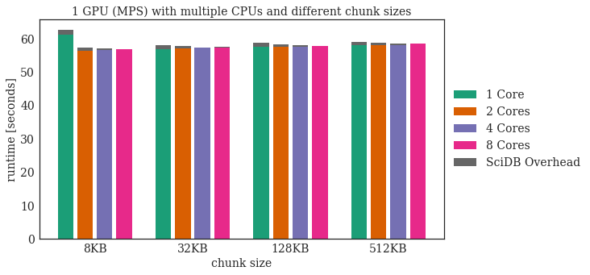
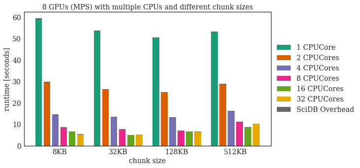
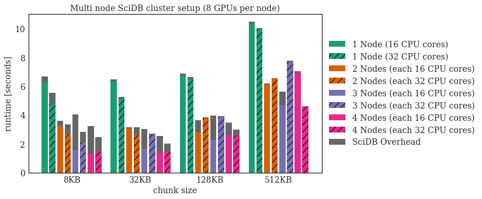
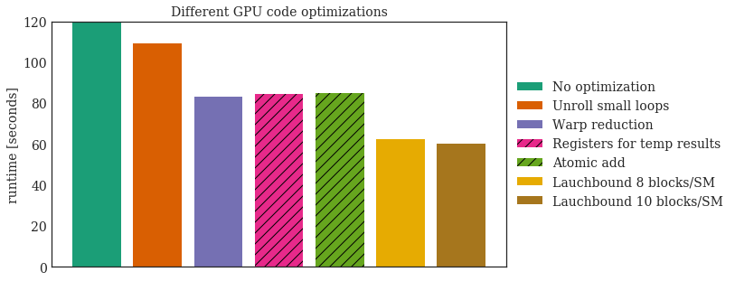

## Analyze the runtime and paramters of the DEM algorithm as SciDB operator accelerated by GPUs


```python
#import needed libraries
import csv
import os
import matplotlib.pyplot as plt
import matplotlib.cm as cm
%matplotlib inline
import numpy as np
import time
from collections import defaultdict
import warnings
import subprocess
from scidbpy import connect, SciDBQueryError, SciDBArray
import re
import datetime
```

Import helper classes and functions to run benchmarks and plot the results.


```python
from plotClusterStackBar import plotClusterStackBar
```

Define an analyzer class which will execute the DEM query and collect timings.


```python
class SciDBAnalyzer:
    """ Helper class to organize all tests and measurements."""
    
    def __init__(self,chunks, instances, titel):
        self.titel = titel
        self.chunk_sizes = chunks
        self.instances = instances
        self.query_ok=b'Query was executed successfully\n'
        self.firedem_messages=("firdem start","firdem done")
        self.config_nbrNodes = 0
        self.config_ChunkSize = 0
        self.statistics = {}
        self.detailStatistics = defaultdict(lambda :list()) 
        self.error=False
    
    def getConfigStr(self):
        return ""+str(self.config_nbrNodes)+"_"+str(self.config_ChunkSize)
    
    def getArrayname(self):
        return "aia_" + str(self.config_ChunkSize)
    
    def setConfig(self, nbrNodex):
        self.config_nbrNodes = nbrNodex
        
    def analyzeQueryFirdem(self):
         # execute query for each config (nbr of instances)
        for nbr_instances in self.instances:
            #status
            print("Working on config with ",nbr_instances, " instances.")
            
            #init SciDB (reload all data)
            self.initSciDB(nbr_instances)
            
            #run query for each chunk size
            self.analyzeQueryFirdemChunk()
            
        return self.error
            
        
    def initSciDB(self,nbrNodes):
            self.config_nbrNodes = nbrNodes
            
            #stop SciDB
            scidb_stop = !scidb.py stopall mydb

            #copy config with nbrNodes
            scidb_copy = !cp /home/simon/scidbtrunk/stage/install/etc/config.ini_{nbrNodes} /home/simon/scidbtrunk/stage/install/etc/config.ini

            #init SciDB with new config (all data will be deleted)
            scidb_init = !scidb.py initall-force mydb

            #start SciDB 
            scidb_start = !scidb.py startall mydb

            #load libraries
            scidb_lib = !iquery -aq "load_library('firdem');"

            #create SciDB Arrays
            self.createSciDBArrays()
            
        
    def analyzeQueryFirdemChunk(self):
        # execute query for each chunk size
        for c_size in self.chunk_sizes:
            self.config_ChunkSize = c_size
            
            command="iquery -antq \"firdem("+self.getArrayname()+",'EMWMT=0');\""
                
            #clear log
            base_path="/home/simon/scidbtrunk/stage/DB-mydb/0/"
            for x in range(0, self.config_nbrNodes):
                file=base_path+str(x)+"/scidb.log"
                subprocess.Popen("> "+file, \
                    shell=True,stdout=subprocess.PIPE).communicate()

            #run convolution query via bash
            start = time.time()
            p = subprocess.Popen(command,shell=True,stdout=subprocess.PIPE)
            output, err = p.communicate()
            end = time.time()

            #if the query run successful
            if output==self.query_ok:
                self.statistics[self.getConfigStr()]=(start,end,end-start)
                self.analyzeLog()
                #print(output)
            else:
                print("ERROR: ",command,": ",output, err)
                self.error=True

                
    def analyzeLog(self):
        #analyze the SciDB log to get exact timing information
        
        base_path="/home/simon/scidbtrunk/stage/DB-mydb/0/"
        
        for x in range(0, self.config_nbrNodes):
            file=base_path+str(x)+"/scidb.log"
            
            with open(file) as f:
                content = f.readlines()
            content = [x.strip() for x in content] 

            regex = re.compile(r'(.{23})(.*):\s(.*)', re.I)

            for line in content:
                res=regex.search(line)
                if res is None: continue
                groups=res.groups()

                if groups[2]=="firdem start": tmpTimeStart = datetime.datetime.strptime(groups[0], "%Y-%m-%d %H:%M:%S,%f")
                if groups[2]=="firdem done":
                    tmpTimeEnd = datetime.datetime.strptime(groups[0], "%Y-%m-%d %H:%M:%S,%f")
                    self.detailStatistics[self.getConfigStr()].append( (tmpTimeStart,tmpTimeEnd,tmpTimeEnd-tmpTimeStart) )
                
                
    def createSciDBArrays(self):
        #create empty arrays
        !iquery -antq "create array aia_image_import <x:int64,y:int64,a0:int16,a1:int16,a2:int16,a3:int16,a4:int16,a5:int16>[csv=0:*,50000,0];"
        !iquery -antq "load(aia_image_import,'/home/simon/jupyter/res/aia_import_image.opaque',-2,'opaque');"

        #create different chunk sizes
        for c_size in self.chunk_sizes:
            !iquery -antq "create array aia_{c_size} <a0:int16,a1:int16,a2:int16,a3:int16,a4:int16,a5:int16>[x=0:4095,{c_size},0,y=0:4095,{c_size},0];"
            !iquery -antq "insert(redimension(aia_image_import,aia_{c_size}),aia_{c_size});"
       
```

Helper functions to enable or disable Cuda MPS (user has to execute sudo commands without PW - put "root    ALL=(ALL:ALL) NOPASSWD: /usr/bin/nvidia-smi" into /etc/sudoers)


```python
def enableMPS(nbrGPUs):
    my_env = os.environ.copy()
    devices="0"
    for i in range(0,nbrGPUs):
        !sudo nvidia-smi -i {i} -c EXCLUSIVE_PROCESS
        if i>0:devices+=","+str(i)
    
    my_env["CUDA_VISIBLE_DEVICES"]    = devices
    my_env["CUDA_MPS_PIPE_DIRECTORY"] = "/tmp/nvidia-mps"
    my_env["CUDA_MPS_LOG_DIRECTORY"]  = "/tmp/nvidia-log"
    subprocess.Popen("nvidia-cuda-mps-control -d",shell=True, env=my_env)
    
def disableMPS(nbrGPUs):
    !echo quit | nvidia-cuda-mps-control
    
    devices="0"
    for i in range(0,nbrGPUs):
        !sudo nvidia-smi -i {i} -c DEFAULT
        if i>0:devices+=","+str(i)
    
```

#### Run on PC with 1 GTX1060
- Chunk size
- Number of cores (1-8)
- Use 1 GPU with MPS


```python
enableMPS(0)
analyzer_1 = SciDBAnalyzer([64,128,256,512],[1,2,4,8],
                                "1 GPU (MPS) with multiple CPUs and different chunk sizes")
error = analyzer_1.analyzeQueryFirdem()
```

    Working on config with  1  instances.
    Query was executed successfully
    ... skipped output ...


Plot the results from the run above.


```python
bars = list()
for i in range(0,len(analyzer_1.instances)):
    bars.append(np.zeros(len(analyzer_1.chunk_sizes)))
    bars.append(np.zeros(len(analyzer_1.chunk_sizes)))

counter=-1
for instance_conf in analyzer_1.instances:
    counter+=1
    for chunk_conf in analyzer_1.chunk_sizes:
        
        #get longest running calculation
        conf = str(instance_conf)+"_"+str(chunk_conf)
        calc_timing = 0
        for tuple_timing in analyzer_1.detailStatistics[conf]:
            if tuple_timing[2].total_seconds() > calc_timing: calc_timing= tuple_timing[2].total_seconds()
        #get overhead of SciDB
        overhead_timinig=analyzer_1.statistics[conf][2]-calc_timing
        #write to bars
        bars[(2*counter)][analyzer_1.chunk_sizes.index(chunk_conf)]=calc_timing
        bars[(2*counter)+1][analyzer_1.chunk_sizes.index(chunk_conf)]=overhead_timinig 


chunkPlot = plotClusterStackBar(4,4,5)
chunkPlot.setXticks(['8KB', '32KB','128KB','512KB'])
chunkPlot.setlegend(('1 Core','2 Cores','4 Cores','8 Cores','SciDB Overhead'))
chunkPlot.setXYLabels("chunk size","runtime [seconds]")
chunkPlot.setTitel(analyzer_1.titel)

chunkPlot.setColorToLayer(4,7)

for i in range(0,len(analyzer_1.instances)):
    chunkPlot.setBarContent(i,i,bars[(2*i)+0])
    chunkPlot.setBarContent(i,4,bars[(2*i)+1])
chunkPlot.plot(log=False)
```





#### Run on Amazon Server p2.xlarge with 8x K80 GPU
- Chunk size
- Number of CPU cores
- 1 Node


```python
enableMPS(8)
analyzer_2 = SciDBAnalyzer([64,128,256,512],[1,2,4,8,16,32],
                                "8 GPUs (MPS) with multiple CPUs and different chunk sizes")
error = analyzer_2.analyzeQueryFirdem("multiGPU=8")
```


```python
bars = list()
for i in range(0,len(analyzer_2.instances)):
    bars.append(np.zeros(len(analyzer_2.chunk_sizes)))
    bars.append(np.zeros(len(analyzer_2.chunk_sizes)))

counter=-1
for instance_conf in analyzer_2.instances:
    counter+=1
    for chunk_conf in analyzer_2.chunk_sizes:
        
        #get longest running calculation
        conf = str(instance_conf)+"_"+str(chunk_conf)
        calc_timing = 0
        for tuple_timing in analyzer_2.detailStatistics[conf]:
            if tuple_timing[2].total_seconds() > calc_timing: calc_timing= tuple_timing[2].total_seconds()
        #get overhead of SciDB
        overhead_timinig=analyzer_2.statistics[conf][2]-calc_timing
        #write to bars
        bars[(2*counter)][analyzer_2.chunk_sizes.index(chunk_conf)]=calc_timing
        bars[(2*counter)+1][analyzer_2.chunk_sizes.index(chunk_conf)]=overhead_timinig 


chunkPlot = plotClusterStackBar(6,4,7)
chunkPlot.setTitel(analyzer_2.titel)
chunkPlot.setXticks(['8KB', '32KB','128KB','512KB'])
chunkPlot.setlegend(('1 CPUCore','2 CPUCores','4 CPUCores','8 CPUCores','16 CPUCores','32 CPUCores','SciDB Overhead'))
chunkPlot.setXYLabels("chunk size","runtime [seconds]")

chunkPlot.setColorToLayer(6,7)

for i in range(0,len(analyzer_2.instances)):
    chunkPlot.setBarContent(i,i,bars[(2*i)+0])
    chunkPlot.setBarContent(i,6,bars[(2*i)+1])
chunkPlot.plot(log=False)
```





#### Run on Amazon Server p2.xlarge with 8x K80 GPU
- Chunk size
- Number of CPU cores
- 1-5 Nodes


```python
analyzer_3 = SciDBAnalyzer([64,128,256,512],['16_1','32_1','16_2','32_2','16_3','32_3','16_4','32_4'],
                                "Multi node SciDB cluster setup (8 GPUs per node)")
error = analyzer_3.analyzeQueryFirdem("multiGPU=8")
```


```python
bars = list()
for i in range(0,len(analyzer_3.instances)):
    bars.append(np.zeros(len(analyzer_3.chunk_sizes)))
    bars.append(np.zeros(len(analyzer_3.chunk_sizes)))

counter=-1
for instance_conf in analyzer_3.instances:
    counter+=1
    for chunk_conf in analyzer_3.chunk_sizes:
        
        #get longest running calculation
        conf = str(instance_conf)+"_"+str(chunk_conf)
        calc_timing = 0
        for tuple_timing in analyzer_3.detailStatistics[conf]:
            if tuple_timing[2].total_seconds() > calc_timing: calc_timing= tuple_timing[2].total_seconds()
        #get overhead of SciDB
        overhead_timinig=analyzer_3.statistics[conf][2]-calc_timing
        #write to bars
        bars[(2*counter)][analyzer_3.chunk_sizes.index(chunk_conf)]=calc_timing
        bars[(2*counter)+1][analyzer_3.chunk_sizes.index(chunk_conf)]=overhead_timinig 


chunkPlot = plotClusterStackBar(8,4,9)
chunkPlot.setTitel(analyzer_3.titel)
chunkPlot.setXticks(['8KB', '32KB','128KB','512KB'])
chunkPlot.setlegend(('1 Node (16 CPU cores)','1 Node (32 CPU cores)','2 Nodes (each 16 CPU cores)','2 Nodes (each 32 CPU cores)','3 Nodes (each 16 CPU cores)','3 Nodes (each 32 CPU cores)','4 Nodes (each 16 CPU cores)','4 Nodes (each 32 CPU cores)','SciDB Overhead'))
chunkPlot.setXYLabels("chunk size","runtime [seconds]")

chunkPlot.setColorToLayer(0,0)
chunkPlot.setColorToLayer(1,0)
chunkPlot.setColorToLayer(2,1)
chunkPlot.setColorToLayer(3,1)
chunkPlot.setColorToLayer(4,2)
chunkPlot.setColorToLayer(5,2)
chunkPlot.setColorToLayer(6,3)
chunkPlot.setColorToLayer(7,3)
chunkPlot.setColorToLayer(8,7)
chunkPlot.setHatchToLayer(1)
chunkPlot.setHatchToLayer(3)
chunkPlot.setHatchToLayer(5)
chunkPlot.setHatchToLayer(7)

for i in range(0,len(analyzer_3.instances)):
    chunkPlot.setBarContent(i,i,bars[(2*i)+0])
    chunkPlot.setBarContent(i,8,bars[(2*i)+1])
chunkPlot.plot(log=False)
```





#### Plot of different implementation details


```python
#data measures were done without SciDB so we just insert the measured values here
bars = [120.0451808,109.0985235,83.16507861,84.61975661,84.95958214,62.58985653,60.17283]
chunkPlot = plotClusterStackBar(7,1,7)
chunkPlot.setTitel("Different GPU code optimizations")
chunkPlot.setlegend(('No optimization','Unroll small loops','Warp reduction','Registers for temp results','Atomic add','Lauchbound 8 blocks/SM','Lauchbound 10 blocks/SM'))
chunkPlot.setXYLabels("","runtime [seconds]")
chunkPlot.setXticks([''])
chunkPlot.setHatchToLayer(3)
chunkPlot.setHatchToLayer(4)
for i in range(0,len(bars)):
    chunkPlot.setBarContent(i,i,[bars[i]])
chunkPlot.plot(log=False)
```




