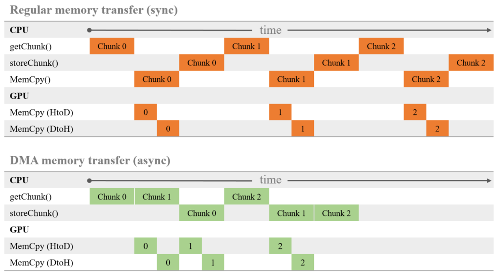
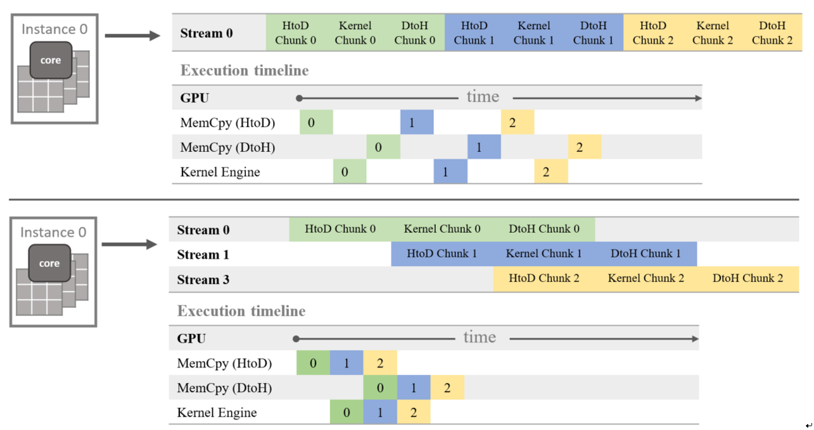
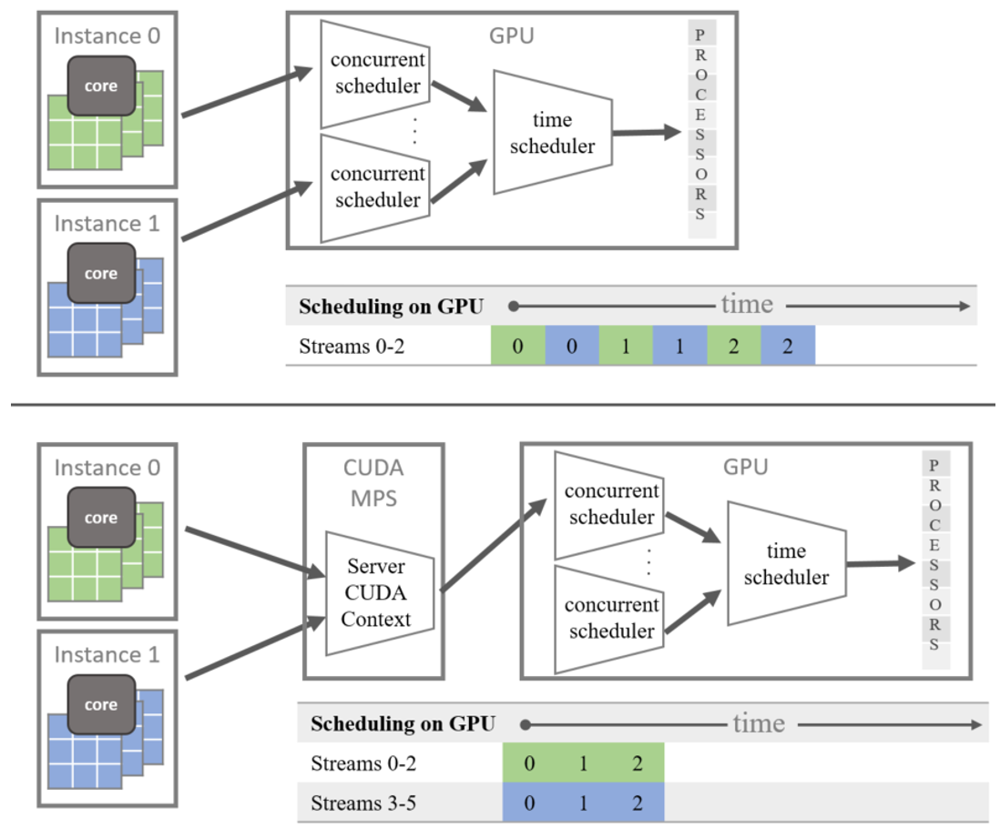

# Evaluation of GPU accelerated algorithms with SciDB

We evaluate the usage of GPUs for SciDB plugins. In order to hide the introduced overhead by the GPUs, we implement different optimization strategies. 

### Content
**UserInterface:** Interface between User and SciDB specific for AIA data. 
**Benchmarks:** Runtime evaluation of our implementation 
**SciDB Plugins:** DEM and Convolution plugin accelerated by GPUs. Util functions are used to abstract SciDB from the GPU kernel.

### How does it work
We use DMA memory copy to the GPU, which is asynchronous in respect to the CPU. This enables overlapping work of the CPU and the GPU. Used in utils/DataAccess.h.

To pipeline more work to the GPU we use three (default) concurrent open chunks on SciDB. This increases the system memory footprint by a factor of three! These chunks will be copied and executed on the GPU by different streams. This enables a concurrent use of all engines on the GPU. Used in utils/GPUHandler.h.

To further pipeline more mork to the GPU, multiple SciDB instances send chunks to the same GPU card. To get rid of the context switching of CUDA, we use the Nvidia MPS layer.

In the best case we can completely hide all of the data movement and calculations of the GPU behind SciDBs loading and storing chunks. In case the GPU kernel runs longer than loading and storing a chunk, we have spare CPU performance which we should harness by also running calculations asynchronous on the CPU.

### Results
We reached a speedup of 10³ (>7000) for the DEM algortihm running on 4 nodes in the Amazon cloud compared to a single CPU core execution. Running it on a PC with a Nvidia GTX 1070 we reached a speedup of 10² (260).
