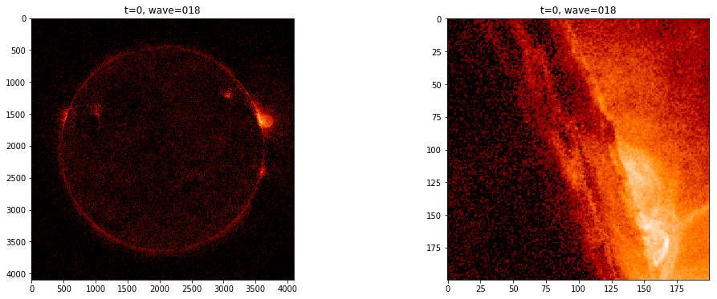
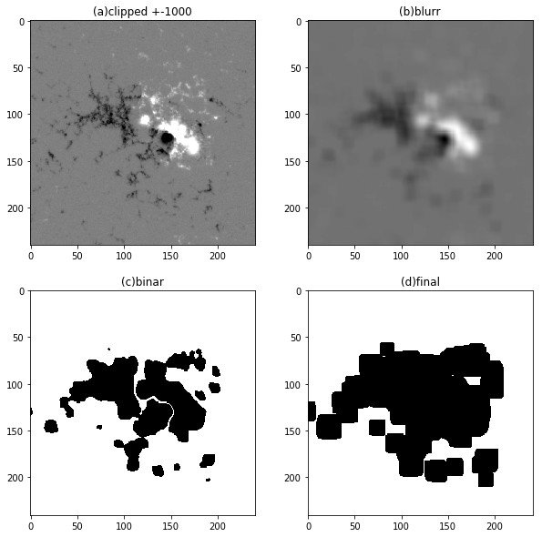
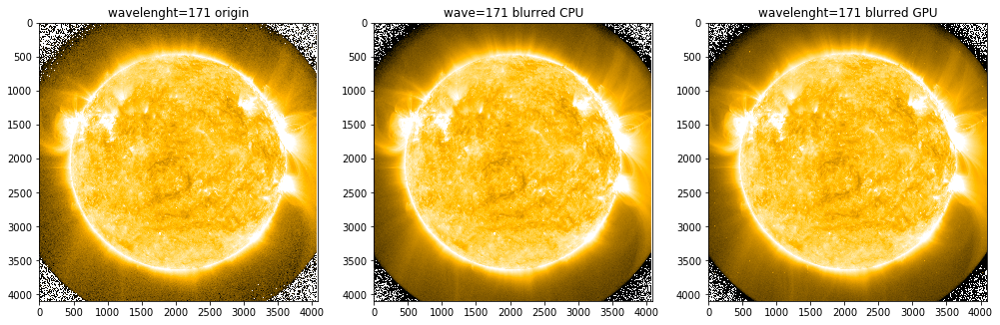
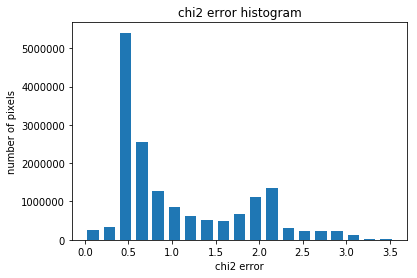
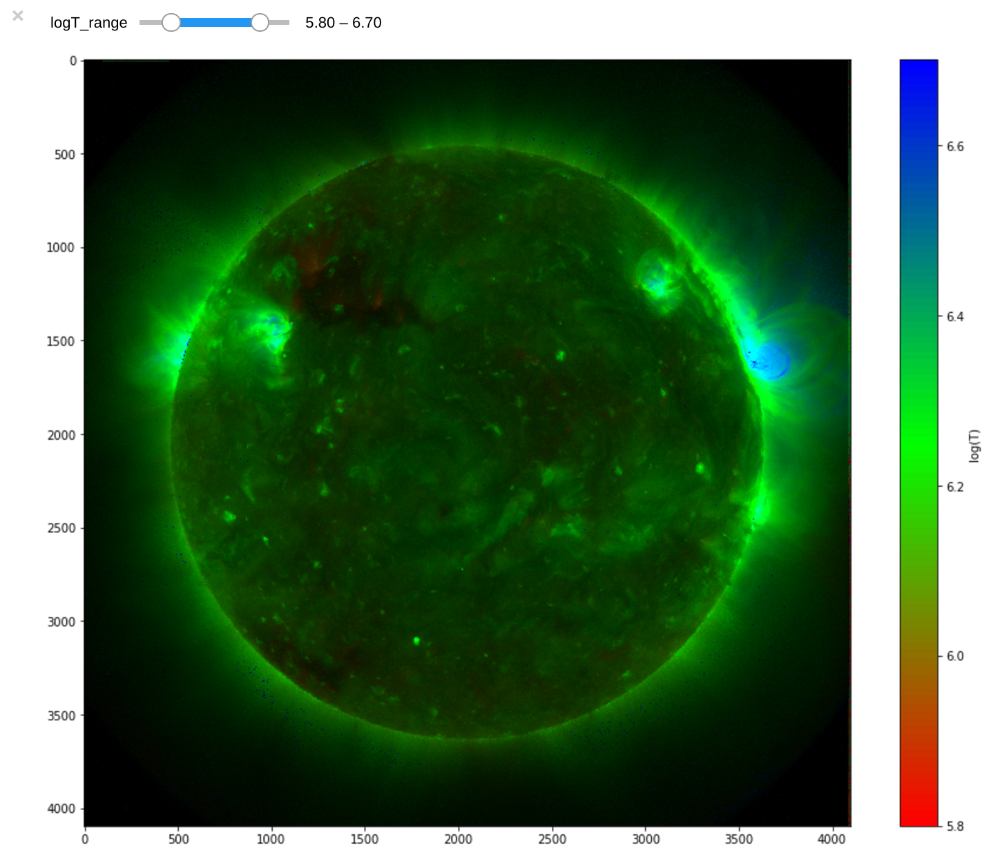
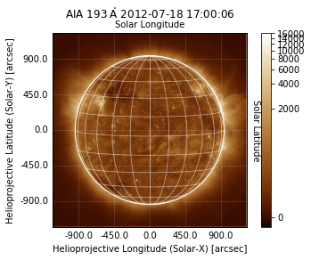
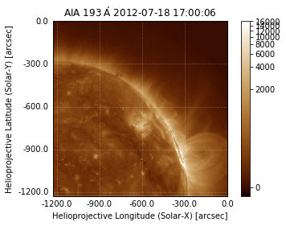

## SciDB and AIA data


```python
# own imports
from scidb_aia_array import SciDB_AIA_Array
from scidb_aia_array import SciDB_AIA_Import

# libraries
from ipywidgets import widgets, interact, FloatSlider, FloatRangeSlider
from scidbpy import connect, SciDBQueryError, SciDBArray
from sunpy.map.sources import AIAMap, Map
import matplotlib
import matplotlib.pyplot as plt
import matplotlib.cm as cm
import matplotlib.colors as colors
import numpy as np
import warnings
#warnings.filterwarnings('ignore')
%matplotlib inline
```

### Import FITS files using SciDB_AIA_Import
This also stores metadata of the Sunpy maps, which will be later used for SciDB_AIA_Array.


```python
aia_import = SciDB_AIA_Import("/home/simon/jupyter/res/fits",
    "/home/simon/scidbtrunk/stage/DB-mydb/AIA_metadata",tmp_path="/run/tmp")
aia_import.createArray("aia_cube")
```

### Basic SciDB usage with AIA data
- Load arrays
- Plot data
- Calculate new attributes
- Run a simple algorithm based on SciDB operators


```python
# Connect to SciDB
sdb = connect('http://localhost:8080')
```


```python
# Load the AIA data and print some information
aia_cube = sdb.wrap_array("aia_cube")
print("Schema:",aia_cube.datashape.schema)
```

    Schema: <aia_94:int16,aia_131:int16,aia_171:int16,aia_193:int16,aia_211:int16,aia_335:int16> [y=0:4096,128,0,x=0:4096,128,0,time=0:299,1,0]


Calculate the iron 18 line and plot one time slice of the new data.


```python
aia018=aia_cube.apply('aia018','aia_94-(aia_211/120)-(aia_171/450)')
# clean the image, remove values <1.
aia018_clean=aia018.apply('aia018_clean','iif(aia018<1,1,aia018)').project('aia018_clean')
#extract 1 time slice
aia018_clean=aia018_clean[0:4096,0:4096,0:1]
aia018_clean=aia018_clean.redimension('<aia018_clean:int64>[x=0:4095,128,0,y=0:4095,128,0]','false')

plt.figure(1,figsize=(17,6))
plt.subplot(121)
plt.title('t=0, wave=018')
plt.imshow(aia018_clean.toarray(), norm=matplotlib.colors.LogNorm(), cmap=plt.get_cmap("sdoaia304"))
plt.subplot(122)
plt.title('t=0, wave=018')
plt.imshow(aia018_clean[1400:1600,3400:3600].toarray(), norm=matplotlib.colors.LogNorm(), cmap=plt.get_cmap("sdoaia304"))
plt.show
```

    (slice(1400, 1600, None), slice(3400, 3600, None))
    <function matplotlib.pyplot.show>





Implement a part of the SMART algorithm. A) Clip data to +- 1000 Gauss. B) Simple gaussian-blur. C) Convert to binary values. D) Grow function


```python
# load a MDI (predecessor of HMI) FITS file used for SMART algorithm
mdi=Map("res/mdi.fd_M_96m_lev182.20031125_080000_TAI.data.fits")
# Insert data into SciDB
mdi_array = sdb.from_array(np.flip(mdi.data,0))
```


```python
# use SciDB operators for algortihm steps
hmi_a=mdi_array.subarray(330,430,570,670).apply('clipped','iif(f0<-1000,-1000,iif(f0>1000,1000,f0))').project('clipped').eval()
hmi_b=hmi_a.window(6,6,6,6,'avg(clipped) as clipped').eval()
hmi_c=hmi_b.apply('binar','iif(clipped<-70,1,iif(clipped>70,1,0))').project('binar').eval()
hmi_d=hmi_c.window(6,6,6,6,'max(binar) as grow').eval()
```


```python
# plot the results
plt.figure(1,figsize=(10,10))
plt.subplot(221)
plt.title('(a)clipped +-1000')
plt.imshow(hmi_a.toarray(), cmap=plt.get_cmap('gray'))
plt.subplot(222)
plt.title('(b)blurr')
plt.imshow(hmi_b.toarray(), cmap=plt.get_cmap('gray'))
plt.subplot(223)
plt.title('(c)binar')
plt.imshow(hmi_c.toarray(), cmap=plt.get_cmap('binary'))
plt.subplot(224)
plt.title('(d)final')
plt.imshow(hmi_d.toarray(), cmap=plt.get_cmap('binary'))
plt.show()
```





## SciDB and our GPU accelerated operators
First, we show how to use the convolution operator.Second, we use the DEM operator to calculate a full disk temperature map of the sun. Both plugins need to be compiled and added to SciDB abd SciDBpy.

See section benchmark for the runtime details.


```python
# We only work on one time slice for this notebook. 
# Extract it from aia_cube and redimension it so we have overlaps in the chunks needed by the convolution.
aia_flat = aia_cube[0:4096,0:4096,0:1]
aia_flat = aia_flat.redimension('<aia_94:int16,aia_131:int16,aia_171:int16,aia_193:int16,aia_211:int16,aia_335:int16> [x=0:4095,128,5,y=0:4095,128,5]','false').eval()
aia_flat.datashape.schema
```

    (slice(0, 4096, None), slice(0, 4096, None), slice(0, 1, None))
    '<aia_94:int16,aia_131:int16,aia_171:int16,aia_193:int16,aia_211:int16,aia_335:int16> [x=0:4095,128,5,y=0:4095,128,5]'


Print the origin data, a blurred one by the CPU and a blurred one by the GPU kernel.


```python
aia_flat_origin = aia_flat['aia_171'].toarray()
aia_flat_cpu_blur = aia_flat['aia_171'].convolution('gauss_blur_11x11',"'runOn=CPU'").toarray()
aia_flat_gpu_blur = aia_flat['aia_171'].convolution('gauss_blur_11x11',"'runOn=GPU'").toarray()

plt.figure(1,figsize=(17,6))
plt.subplot(131)
plt.title('wavelenght=171 origin')
plt.imshow(aia_flat_origin, norm=matplotlib.colors.LogNorm(vmin=1.,vmax=1000.), cmap=cm.get_cmap('sdoaia171'))
plt.subplot(132)
plt.title('wave=171 blurred CPU')
plt.imshow(aia_flat_cpu_blur,norm=matplotlib.colors.LogNorm(vmin=1.,vmax=1000.), cmap=cm.get_cmap('sdoaia171'))
plt.subplot(133)
plt.title('wavelenght=171 blurred GPU')
plt.imshow(aia_flat_gpu_blur, norm=matplotlib.colors.LogNorm(vmin=1.,vmax=1000.), cmap=cm.get_cmap('sdoaia171'))
plt.show
```

    aia_171
    aia_171
    aia_171
    <function matplotlib.pyplot.show>





Calculate the DEM of a full disk AIA image.


```python
dem = aia_flat.firdem('EMWMT=1')
print(dem.datashape.schema)
```

    <t_0:double,t_1:double,t_2:double,t_3:double,t_4:double,t_5:double,t_6:double,t_7:double,t_8:double,t_9:double,t_10:double,t_11:double,t_12:double,t_13:double,t_14:double,t_15:double,t_16:double,t_17:double,t_18:double,t_19:double,t_20:double,t_21:double,t_22:double,t_23:double,t_24:double,t_25:double,t_26:double,t_27:double,t_28:double,t_29:double,t_30:double,t_31:double,chi2:double,emtot:double,emwmt:double> [x=0:4095,128,0,y=0:4095,128,0]


Plot the chi2 error distribution of the DEM output. We should reach an error in order of unity for 99.5% of pixels.


```python
chi2 = dem['chi2'].toarray()
mybins = np.linspace(np.min(chi2), np.percentile(chi2,99.5),20)
hist, bins = np.histogram(chi2, mybins)
width = 0.7 * (bins[1] - bins[0])
center = (bins[:-1] + bins[1:]) / 2
plt.bar(center, hist, align='center', width=width)
plt.title("chi2 error histogram")
plt.xlabel("chi2 error")
plt.ylabel("number of pixels")
plt.show()
```





Init a helper function to plot a true-color images from the DEM using the emission weighted median temperature (EMWMT) as hue and total EM as intensity.


```python
def plot_emwtemp_image(emwmt,emtot,logtmin=5.85, logtmax=6.75):
    '''
    Plots a true-color images from the DEM using the emission weighted median temperature (EMWMT) 
    as hue and total EM as intensity.
    
    :param emwmt:   emission weighted median (base 10 log) temperature of each pixel as numpy array.
    :param emtot:   total emission measure in each pixel as numpy array.
    :param logtmin: minimum of temperature range for color the image. Default: 5.85
    :param logtmax: maximum of temperature range for color the image. Default: 6.75
    '''
    xrange = logtmax-logtmin
    xmid = logtmin+0.5*xrange

    # calculate rgb array
    r=1.0-(emwmt-logtmin)/(0.5*xrange)
    r=np.clip(r,0.0,1.0)
    r*=np.sqrt(emtot)
    g=1.0-np.absolute(emwmt-xmid)/(0.5*xrange)
    g=np.clip(g,0.0,1.0)
    g*=np.sqrt(emtot)
    b=1.0-np.absolute(logtmax-emwmt)/(0.5*xrange)
    b=np.clip(b,0.0,1.0)
    b*=np.sqrt(emtot)
    rgb=np.stack([r,g,b],-1)
    pmax = 1.25 * np.percentile(rgb,99.5)
    rgb=np.clip(rgb,0.0,pmax)
    rgb=rgb/pmax
    # add alpha channel (all ones)
    dims=rgb.shape
    a=np.ones((dims[0],dims[1],1))
    rgba=np.concatenate((rgb,a),axis=2)

    #create image and colorbar
    fig, ax = plt.subplots(figsize=(15, 12))
    colors = [(1, 0, 0), (0, 1, 0), (0, 0, 1)]  # R -> G -> B
    n_bins =  100
    cmap = matplotlib.colors.LinearSegmentedColormap.from_list("emwmt", colors, N=n_bins)
    im = ax.imshow(rgba)
    norm = matplotlib.colors.Normalize(vmin=logtmin, vmax=logtmax)
    sm = plt.cm.ScalarMappable(cmap=cmap, norm=norm)
    sm.set_array([])
    color = fig.colorbar(sm)
    color.set_label('log(T)')
    plt.show()
```

Create an interactive plot for the DEM results. In this notebook we only recalculate the image and not the DEM itself. Recalculating the DEM with interactive parameters works only in the cloud. But this shows exactly what our goal - work interactive with Big Data.


```python
# get the emission weighted median (base 10 log) temperature (emwmt) and the total emission measure (emtot).
emwmt = dem['emwmt'].toarray()
emtot = dem['emtot'].toarray()

paramtools = {
    'logT_range' : FloatRangeSlider(min=5.5, max=7.0, step=.1, value=[5.8,6.7]),
}

@interact(**paramtools)
def plot_model_interact(logT_range):
    plot_emwtemp_image(emwmt,emtot, logtmin=logT_range[0], logtmax=logT_range[1])
```





## SciDB and our SciDB_AIA_Array wrapper
SciDB_AIA_Array uses the metadata of the import at the beginning of this document.


```python
# Wrap aia_cube
SciDB_AIA_Array(aia_cube, "/home/simon/scidbtrunk/stage/DB-mydb/AIA_metadata")
# Use slicing to get a full disk image and a submap
aia_0_full = aia_cube['aia_193'][0:4096,0:4096,0:1].toSunpyMap()
aia_0_submap = aia_cube['aia_193'][2048:4096,2048:4096,0:1].toSunpyMap()
```

    aia_193
    (slice(0, 4096, None), slice(0, 4096, None), slice(0, 1, None))
    aia_193
    (slice(2048, 4096, None), slice(2048, 4096, None), slice(0, 1, None))


```python
aia_0_full.peek(draw_limb=True, draw_grid=True)
```





```python
aia_0_submap.peek()
```





Remove all SciDBpy temporary arrays.


```python
sdb.reap()
```
